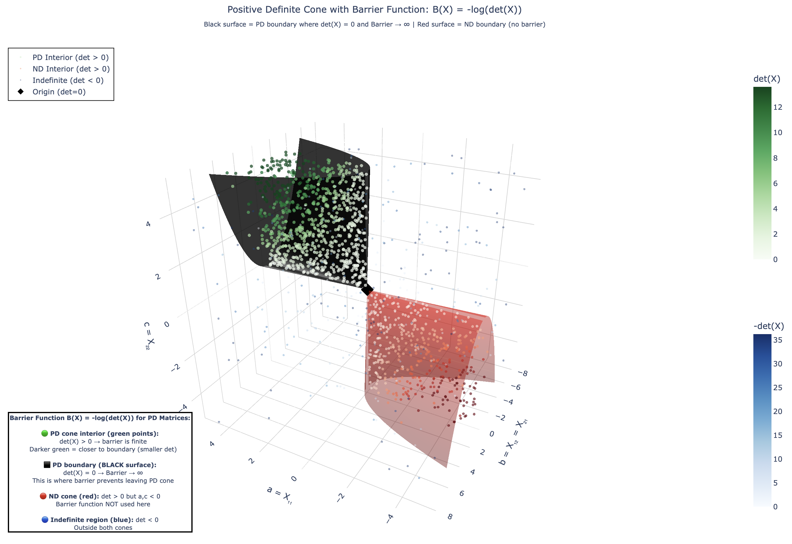

# Matrix Cones Visualization

Visualize the cones of positive definite, negative definite, and indefinite matrices in the space of symmetric 2x2 matrices.

For a symmetric matrix $X = \begin{bmatrix} a & b \\ b & c \end{bmatrix}$, we represent it as a point $(a, b, c) \in \mathbb{R}^3$.

Regions:
- Positive Definite: $a > 0, c > 0, ac - b^2 > 0$
- Negative Definite: $a < 0, c < 0, ac - b^2 > 0$
- Indefinite: $ac - b^2 < 0$
- Boundaries: $\det(X) = ac - b^2 = 0$

## Barrier Function

The barrier function $B(X) = -\log(\det(X))$ is used for positive definite matrices in optimization.

- Inside PD cone: $\det(X) > 0$ → barrier is finite
- On boundary: $\det(X) = 0$ → barrier → ∞

The barrier prevents algorithms from leaving the feasible region of PD matrices.
